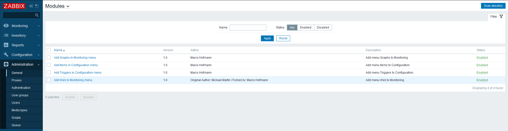
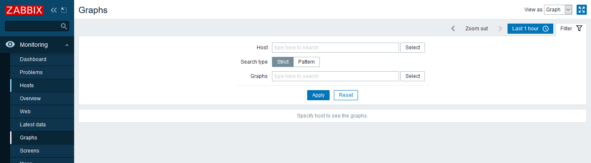
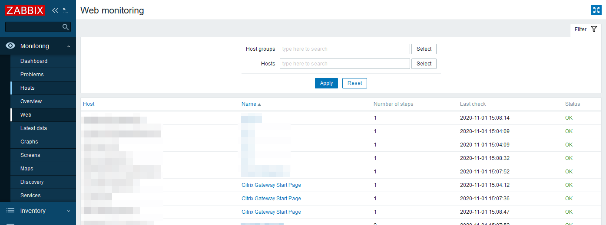
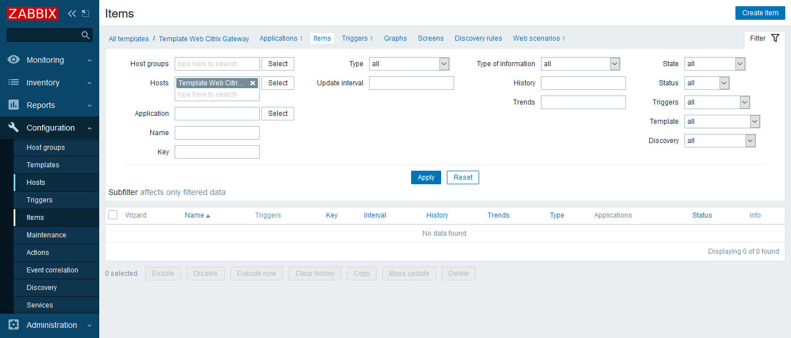
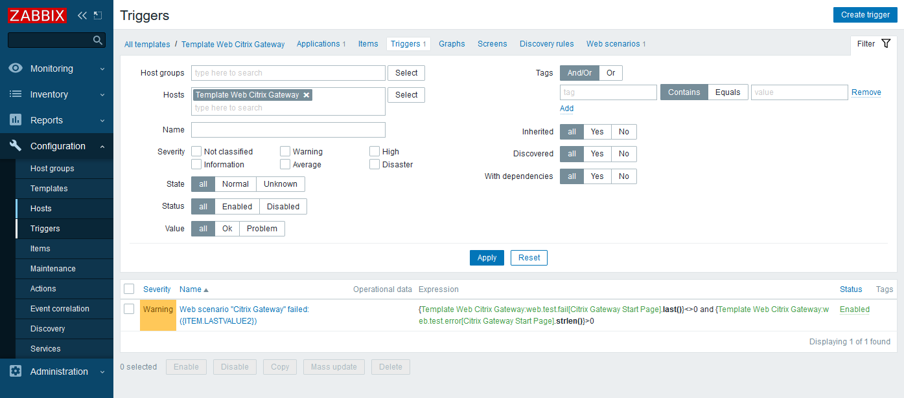

# Zabbix Frontend Modules

## Introduction

Leveraging the new feature of Zabbix 5.0 LTS, these **Frontend Modules** can extend the Zabbix Sidebar menu.

You can read more about this new feature in the official Zabbix documentation: <https://www.zabbix.com/documentation/current/manual/modules>

The modules in this repository were tested on Zabbix 5.0.2+ on Debian 10 Buster.

## Zabbix Monitoring menu

### Add Graphs In Monitoring menu

Adds a new menu entry **Graphs** to the Monitoring section of the sidebar menu.  
It's a direct link to: <https://FQDN/zabbix/zabbix.php?action=charts.view>

### Add Web In Monitoring menu

Adds a new menu entry **Web** to the Monitoring section of the sidebar menu.  
It's a direct link to: <https://FQDN/zabbix/zabbix.php?action=web.view>

## Zabbix Configuration menu

### Add Items in Configuration menu

Adds a new menu entry **Items** to the Configuration section of the sidebar menu.  
It's a direct link to: <https://FQDN/zabbix/items.php>

### Add Triggers in Configuration menu

Adds a new menu entry **Triggers** to the Configuration section of the sidebar menu.  
It's a direct link to: <https://FQDN/zabbix/triggers.php>

## Installation

- Go to your Zabbix Frontend installation module folder
  - (Default path: `/usr/share/zabbix/modules`)
- You may then `git clone https://github.com/xenadmin/zabbix-frontend-modules.git` the repository
  - Or download the desired module manually into the modules directory
- Sometimes it's necessary to change the owner of the directory to your web user
  - For example: `chown -R www-data`
- Go to your Zabbix Frontend: Administration -> General -> Modules
- Press the **Scan directory** button in the top right corner
- Enable the desired module(s)
- Watch how the menu gets extended with new entries

## Troubleshooting

If your Zabbix Frontend remains empty and malfunctioning after the activation of a Zabbix Frontend module, **don't panic!**

First of all, go to the offical Zabbix module documentation and check the Troubleshooting section:
<https://www.zabbix.com/documentation/current/manual/modules>

Most of the time, the fastest solution is to just remove the module directory from your Zabbix Frontend installation (For example: `rm /usr/share/zabbix/modules/add-web-in-monitoring-menu`). Then just reload you browser and Zabbix Frontend should load as expected.

## Notes

This modules wouldn't be possible without the help of Mickael Martin ([Source 1](https://framagit.org/Mickael-Martin) & [Source 2](https://support.zabbix.com/secure/ViewProfile.jspa?name=mma)) , who created [the very first modules](https://framagit.org/zabbix-modules) (check them out!) and Zabbix developer [Valdis Murzins](https://support.zabbix.com/secure/ViewProfile.jspa?name=vmurzins) who helped with further modules during the discussion of [ZBXNEXT-6105](https://support.zabbix.com/browse/ZBXNEXT-6105). They were my inspiration to create this repository. **Thank you!**

## Blog post

<https://www.meinekleinefarm.net/zabbix-frontend-modules/>

## Changelog

- 01 November 2020: Initial commit
